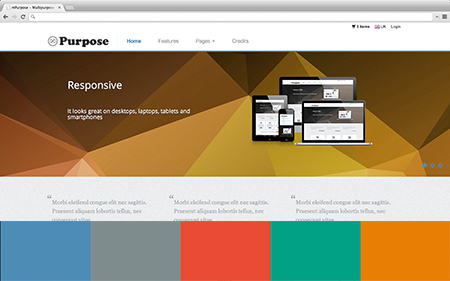

# Multipurpose Twitter Bootstrap 3 template

**mPurpose** is a free multipurpose Twitter Bootstrap 3 template by [http://www.dragdropsite.com](http://www.dragdropsite.com)

**For More info** [click here](http://www.dragdropsite.com/freebies/mpurpose-free-multipurpose-twitter-bootstrap-3-template)

**For Demo** [click here](http://www.dragdropsite.com/demo/mpurpose-free-multipurpose-twitter-bootstrap-3-template)


## Main Template Features

  * Responsive 
  * 5 pre-made Color Schemes and it’s easy to create your own ones 
  * Feature Rich (a huge amount of components, over 30 sample pages) 
  * LESS
  * Support for all modern browsers
  * Much more...

## About Documentation

  * Documentation covers paths that might be tricky
  * Helps to find resources (HTML, CSS files) related to a particular component 
  * Includes some code examples
  * You’ll find component dependencies listed (jQuery, bxSlider, sequencejs, etc.) 
  * You’ll find some useful tip & hints

#  Short Intro

###  General usage hints

  * Probably, the best way to use this template and its components is copy-paste technique :) 
    * Open HTML page containing a component you want to use (documentation will help you to find a necessary HTML file) 
    * Copy HTML 
    * Adjust HTML/JavaScript to your needs 
    * Make sure all dependencies are included (please check the documentation) 
    * Done 
  * Almost all template components are wrapped into `<div class="section">...</div>`. It’s advised to follow this pattern 

###  Template Directory Structure

  * **\css** - css style sheets 
  * **\img** and subfolders - template images 
  * **\js** - template JavaScript files 
  * **\less** - template LESS CSS files 

###  CSS Files

  * **bootstrap.css**, **bootstrap.min.css**, **bootstrap-theme.css**, **bootstrap-theme.min.css**  - Twitter Bootstrap styles 
  * **coming-soon-social.css** - social icons sprite for coming soon page 
  * **icomoon-social.css** - social icons sprite 
  * **leaflet.css**, **leaflet.ie.css** - styles for leaflet maps 
  * **main.css** - mPurpose template styles (Blue Color Scheme) 
  * **main-orange.css** - mPurpose template styles (Orange Color Scheme) 
  * **main-green.css** - mPurpose template styles (Green Color Scheme) 
  * **main-red.css** - mPurpose template styles (Red Color Scheme) 
  * **main-grey.css** - mPurpose template styles (Grey Color Scheme) 

###  LESS Files

  * **components.less** - contains styles for all template components, overrides some Twitter Bootstrap styles 
  * **general.less** - general & typography styles 
  * **lesshat.less** - less mixins. More information could be found on website: [http://lesshat.com](http://lesshat.com/)
  * **main.less** - combines all less files. Use it for CSS compilation 
  * **variables.less** - template variables. Use this file to create your own color schemes 

###  JavaScript Files

  * **bootstrap.js, bootstrap.min.js** - Twitter Bootstrap components 
  * **jquery.bxslider.js** - content slider used for products sliders. Plugin homepage: [http://bxslider.com](http://bxslider.com/)
  * **jquery.fitvids.js** - makes embedded videos responsive. Plugin homepage: [http://fitvidsjs.com](http://fitvidsjs.com/)
  * **jquery.sequence-min.js** - CSS3 slider used for homepage slider. Plugin homepage: [http://www.sequencejs.com](http://www.sequencejs.com/)
  * **main-menu.js** - JavaScript for Mega Dropdown Menu
  * **modernizr-2.6.2-respond-1.1.0.min.js** - HTML5 and CSS3 features detection in the user’s browser. Plugin homepage: [http://modernizr.com](http://modernizr.com/)
  * **template.js** - JavaScript for mPurpose template components 

#  General Features

##  Color Schemes

**mPurpose** template comes with five pre-made color themes (_Blue, Orange, Green, Red, Grey_). Choose a relevant CSS file from css folder: 

  * **main.css** - Blue color scheme (default) 
  * **main-orange.css** - Orange color scheme 
  * **main-green.css** - Green color scheme 
  * **main-red.css** - Red color scheme 
  * **main-grey.css** - Grey color scheme 

**mPurpose** template is developed using LESS so it’s very easy to create your own color schemes matching your branding - all you need to do is to change one variable!
Please check **[LESS](#less)** chapter for more
information.

##  LESS

This template is build taking an advantage of LESS CSS. All LESS files could
be found in _less_ folder. Here is the list of LESS files:

  * **components.less** - contains styles for all template components, overrides some Twitter Bootstrap styles 
  * **general.less** - general & typography styles 
  * **lesshat.less** - less mixins. More information could be found on website: [http://lesshat.com](http://lesshat.com/)
  * **main.less** - combines all less files. Use it for CSS compilation 
  * **variables.less** - template variables. Use this file to create your own color schemes 

More info about LESS could be found here:

 - [http://lesscss.org](http://lesscss.org/)

Here are some LESS compilers:

 - [less.app](http://incident57.com/less/) (Mac)
 - [http://wearekiss.com/simpless](http://wearekiss.com/simpless) (Mac, Linux, Windows)
 - [http://winless.org/](http://winless.org/) (Windows) 
 - [http://crunchapp.net/](http://crunchapp.net/) (Mac, Windows)

#  Template Components

##  Homepage Slider

  * HTML example could be found here: _“index.html”_
  * CSS / LESS style: search for comment containing _“Homepage Slider Style”_
  * Dependencies: jQuery, sequencejs library ([http://www.sequencejs.com](http://www.sequencejs.com/)) 

**Usage**

  * Include **jquery.sequence-min.js**: `<script src="js/jquery.sequence-min.js"></script>`
  * Put HTML code for your slider. Here is a code example: 
    
```html    
<div class="homepage-slider">
          <div id="sequence">
        <ul class="sequence-canvas">
          <!-- Slide 1 -->
          <li class="bg4">
            <!-- Slide Title -->
            <h2 class="title">Slide Title</h2>
            <!-- Slide Text -->
            <h3 class="subtitle">Slide Subtitle</h3>
            <!-- Slide Image -->
            
          </li>
          <!-- End Slide 1 -->
          <!-- Slide 2 -->
          <li class="bg3">
            <!-- Slide Title -->
            <h2 class="title">Slide Title</h2>
            <!-- Slide Text -->
            <h3 class="subtitle">Slide Subtitle</h3>
            <!-- Slide Image -->
            
          </li>
          <!-- End Slide 2 -->
        </ul>
        <div class="sequence-pagination-wrapper">
          <ul class="sequence-pagination">
            <li>1</li>
            <li>2</li>
            <li>3</li>
          </ul>
        </div>
      </div>
        </div>
```

  * Initialize slider by placing JavaScript code: 
    
```
var options = {
  nextButton: false,
  prevButton: false,
  pagination: true,
  animateStartingFrameIn: true,
  autoPlay: true,
  autoPlayDelay: 3000,
  preloader: true
};

var mySequence = $("#sequence").sequence(options).data("sequence");
```    

More information and configuration options could be found on sequencejs
website [http://www.sequencejs.com](http://www.sequencejs.com/)

**Other tips & hints**

  * Template comes with 14 slider backgrounds, they could be found in folder _“img\homepage-slider”_
  * Slide background could be changed by putting a relevant CSS class _bg1, bg2, … bg10_ (please check a code example above) 

##  'Featured In Press' Component

  * HTML example could be found here: _“page-about-us.html”_
  * CSS / LESS style: search for comment containing _“In Press Style”_

**Other tips & hints**

  * CSS Sprites are used to display media logos (take a look at _“img/in-press.png”_). 
  * Logo dimensions: 120x32 

##  Custom Buttons

Template comes with some custom buttons - here are CSS classes for them:

  * `.btn-grey`
  * `.btn-blue`
  * `.btn-orange`
  * `.btn-green`
  * `.btn-red`

Note that standard Twitter Bootstrap buttons (CSS class .btn) will look a bit
differently - they will match the color scheme

##  Mega Dropdown Menu

**mPurpose** template includes Mega Dropdown Menu component which is used for main menu (select “Pages” menu item to see Mega Dropdown Menu in action). 

**Usage**

  * Include **main-menu.js**: `<script src="js/main-menu.js"></script>`
  * Put HTML code for your menu. Here is a code example: 
    
```    
<nav id="mainmenu" class="mainmenu">
    <ul>
        <li class="logo-wrapper">
            <a href="index.html"></a>
        </li>
        <!--Active Menu Item -->
        <li class="active"><a href="index.html">Home</a></li>
        <!-- Menu Item containing submenu -->
        <li class="has-submenu">
            <a href="#">Menu with submenus</a>
            <!-- Dropdown Menu containing submenu items -->
            <div class="mainmenu-submenu">
                <div class="mainmenu-submenu-inner"> 
                    <!-- Column 1 -->
                    <div>
                        <h4>Section Title 1</h4>
                        <ul>
                            <li><a href="#">Submenu Item</a></li>
                            <li><a href="#">Submenu Item</a></li>
                            ...
                        </ul>
                        <h4>Section Title 2</h4>
                        <ul>
                            <li><a href="#">Submenu Item</a></li>
                            <li><a href="#">Submenu Item</a></li>
                            ...
                        </ul>
                    </div>
                    <!-- Column 2 -->
                    <div>
                        <h4>Section Title 3</h4>
                        <ul>
                            <li><a href="#">Submenu Item</a></li>
                            <li><a href="#">Submenu Item</a></li>
                            ...
                        </ul>
                    </div>
                    <!-- Column 3 -->
                    <div>
                        <h4>Section Title 4</h4>
                        <ul>
                            <li><a href="#">Submenu Item</a></li>
                            <li><a href="#">Submenu Item</a></li>
                            ...
                        </ul>
                        <h4>Section Title 5</h4>
                        <ul>
                            <li><a href="#">Submenu Item</a></li>
                            <li><a href="#">Submenu Item</a></li>
                            ...
                        </ul>
                    </div>
                </div> class="comment"><!-- /mainmenu-submenu-inner -->
            </div> class="comment"><!-- /mainmenu-submenu -->
        </li>
    </ul>
</nav>
``` 

  * Initialize Mega Dropdown Menu by placing JavaScript code: `mainMenu.init();`. Note that Mega Dropdown Menu ID should be `mainmenu` (`<nav id="mainmenu" class="mainmenu">...</nav>`) 

**Other tips & hints**

  * Use CSS class `.active` to indicate an active menu item 
  * Make sure Menu Items containing submenu has CSS class `.has-submenu`. Otherwise submenu won't work 
  * Use `<div>...</div>` inside submenu to create submenu columns (max 3 columns will be created) 
  * Note that you can define as many submenu column sections as you need: 
    
```  
<div>
    <h4>Section Title 1</h4>
    <ul>
        <li><a href="#">Submenu Item</a></li>
        <li><a href="#">Submenu Item</a></li>
        ...
    </ul>
    <h4>Section Title 2</h4>
    <ul>
        <li><a href="#">Submenu Item</a></li>
        <li><a href="#">Submenu Item</a></li>
        ...
    </ul>
    ...
</div>
```   

##  Responsive Videos

  * HTML example could be found here: _“page-about-us.html”_
  * CSS / LESS style: search for comment containing _“Video Wrapper Style”_
  * Dependencies: jQuery, fitVids library ([http://fitvidsjs.com](http://fitvidsjs.com/)) 

**Usage**

  * Include jquery.fitvids.js: `<script src="js/jquery.fitvids.js"></script>`
  * Put HTML code to embed a video and wrap it into `<div class="video-wrapper">...</div>` e.g.: 
    
```    
<div class="video-wrapper">
        <iframe src="http://player.vimeo.com/video/47000322?title=0&byline=0&portrait=0" width="500" height="281" frameborder="0" webkitAllowFullScreen mozallowfullscreen allowFullScreen></iframe>
</div>
```    

  * Initialize responsive video by placing JavaScript code: `$(".video-wrapper").fitVids();`

**Other tips & hints**

  * Make sure to wrap video into `<div class="video-wrapper"> ... </div>` to make it responsive. Currently supported players: YouTube, Vimeo, Blip.tv, Viddler, Kickstarter 
  * More information could be found on fitVids plugin website: [http://fitvidsjs.com](http://fitvidsjs.com/)

##  Page Title

  * HTML example could be found in most of demo files starting with _“page-“_
  * CSS / LESS style: search for comment containing _“Breadcrumbs Section Style”_
  * Dependencies: N/A 

##  Additional Icons - Flags

Template comes with 247 flag icons representing most countries in the world.
These icons could be found in _“img/flags”_ directory

##  Additional Icons - Social Icons

Template comes with icons for most popular social networks including:

  * Google+ (`<i class="icon-google-plus"></i>`) 
  * Facebook (`<i class="icon-facebook"></i>`) 
  * Twitter (`<i class="icon-twitter"></i>`) 
  * Vimeo (`<i class="icon-vimeo2"></i>`) 
  * Flickr (`<i class="icon-flickr"></i>`) 
  * Picasa (`<i class="icon-picassa"></i>`) 
  * Dribbble (`<i class="icon-dribbble"></i>`) 
  * Github (`<i class="icon-github"></i>`) 
  * Wordpress (`<i class="icon-wordpress"></i>`) 
  * Blogger (`<i class="icon-blogger"></i>`) 
  * Tumblr (`<i class="icon-tumblr"></i>`) 
  * Soundcloud (`<i class="icon-soundcloud"></i>`) 
  * Linkedin (`<i class="icon-linkedin"></i>`) 
  * Lastfm (`<i class="icon-lastfm"></i>`) 
  * Stumbleupon (`<i class="icon-stumbleupon"></i>`) 
  * Pinterest (`<i class="icon-pinterest"></i>`) 

You can check them in action on “Features” page

##  Services

  * There are 3 different layouts: 
    * **1 Column** - HTML example could be found here _“page-services-1-column.html”_
    * **3 Columns** - HTML example could be found here _“page-services-3-columns.html”_
    * **4 Columns** - HTML example could be found here _“page-services-4-columns.html”_
  * CSS / LESS style: search for comment containing _“Services Style”_
  * Dependencies: N/A 

##  Pricing Table

  * HTML example could be found here: _“page-pricing.html”_
  * CSS / LESS style: search for comment containing _“Pricing Table Style”_
  * Dependencies: N/A 

**Other tips & hints**

  * You can use ribbons for pricing tables. Just place `<div class="ribbon-wrapper"><div class="price-ribbon ribbon-green"> ... </div></div>` before pricing plan title. There are 4 predefined colors for ribbons (_Green, Blue, Orange, Red_) - use a relevant css class for that: _ribbon-green, ribbon-blue, ribbon-orange, ribbon-red_

##  Team & Open Vacancies

###  Team

  * HTML example could be found here: _“page-team.html”_
  * CSS / LESS style: search for comment containing _“Our Team Style”_
  * Dependencies: N/A 

###  Open Vacancies

  * HTML example could be found here: _“page-vacancies.html”_
  * CSS / LESS style: search for comment containing _“Jobs list Style”_
  * Dependencies: N/A 

##  Our Work (Portfolio)

###  Portfolio List

  * There are 4 different layouts available: 
    * **2 Columns, Option 1** - HTML example could be found here _“page-portfolio-2-columns-1.html”_
    * **2 Columns, Option 2** - HTML example could be found here _“page-portfolio-2-columns-2.html”_
    * **3 Columns, Option 1** - HTML example could be found here _“page-portfolio-3-columns-1.html”_
    * **3 Columns, Option 2** - HTML example could be found here _“page-portfolio-3-columns-2.html”_
  * CSS / LESS style: search for comment containing _“Portfolio Style”_
  * Dependencies: N/A 

###  Portfolio Item (Project)

  * HTML example could be found here: _“page-portfolio-item.html”_
  * CSS / LESS style: search for comment containing _“Portfolio Style”_
  * Dependencies: N/A 

##  General Pages

###  About Us

  * HTML example could be found here: _“page-about-us.html”_
  * CSS / LESS style: search for comment containing _“Video Wrapper Style”_
  * Dependencies: N/A 

Please also check the chapter **[Responsive Videos](#responsive-videos)**

###  Contact Us

  * HTML example could be found here: _“page-contact-us.html”_
  * CSS / LESS style: search for comment containing _“Contact Us Style”_
  * Dependencies: N/A 

###  Frequently Asked Questions

  * HTML example could be found here: _“page-faq.html”_
  * CSS / LESS style: search for comment containing _“Frequently Asked Questions Style”_
  * Dependencies: N/A 

###  Testimonials & Clients

  * HTML example could be found here: _“page-testimonials-clients.html”_
  * CSS / LESS style: search for comment containing _“Testimonials Style”, “Clients Logos Style”_
  * Dependencies (for Testimonials): N/A 

**Usage (Testimonials)**

  * Put HTML for your testimonials slider. Here is a code example: 
    
```    
<div class="section">
      <div class="container">
        <h2>Testimonials</h2>
        <div class="row">
          <!-- Testimonial -->
          <div class="testimonial col-md-4 col-sm-6">
            <!-- Author Photo -->
            <div class="author-photo">
              
            </div>
            <div class="testimonial-bubble">
              <blockquote>
                <!-- Quote -->
                <p class="quote">
                                "Lorem ipsum dolor sit amet, consectetur adipisicing elit, sed do eiusmod tempor incididunt ut."
                            </p>
                            <!-- Author Info -->
                            <cite class="author-info">
                              - Name Surname,<br>Managing Director at <a href="#">Some Company</a>
                            </cite>
                          </blockquote>
                          <div class="sprite arrow-speech-bubble"></div>
                        </div>
                    </div>
                    <!-- End Testimonial -->
                    <div class="testimonial col-md-4 col-sm-6">
            <div class="author-photo">
              
            </div>
            <div class="testimonial-bubble">
              <blockquote>
                <p class="quote">
                                "Ut enim ad minim veniam."
                            </p>
                            <cite class="author-info">
                              - Name Surname,<br>Managing Director at <a href="#">Some Company</a>
                            </cite>
                          </blockquote>
                          <div class="sprite arrow-speech-bubble"></div>
                        </div>
                    </div>
          <div class="testimonial col-md-4 col-sm-6">
            <div class="author-photo">
              
            </div>
            <div class="testimonial-bubble">
              <blockquote>
                <p class="quote">
                                "Duis aute irure dolor."
                            </p>
                            <cite class="author-info">
                              - Name Surname,<br>Managing Director at <a href="#">Some Company</a>
                            </cite>
                          </blockquote>
                          <div class="sprite arrow-speech-bubble"></div>
                        </div>
                    </div>
        </div>
      </div>
      </div>
```    

  * Initialize testimonials slider by placing JavaScript code (skip this step if you don’t want testimonials to slide): 

###  Events

  * HTML example could be found here: _“page-events.html”_
  * CSS / LESS style: search for comment containing _“Events List Style”_
  * Dependencies: N/A 

###  404 Page

  * HTML example could be found here: _“page-404.html”_
  * CSS / LESS style: search for comment containing _“404 Page Style”_
  * Dependencies: N/A 

###  Sitemap

  * HTML example could be found here: _“page-sitemap.html”_
  * CSS / LESS style: search for comment containing _“Sitemap Style”_
  * Dependencies: N/A 

###  Login

  * HTML example could be found here: _“page-login.html”_
  * CSS / LESS style: search for comment containing _“Login/Register/Reset Password Forms Style”_
  * Dependencies: N/A 

###  Register

  * HTML example could be found here: _“page-register.html”_
  * CSS / LESS style: search for comment containing _“Login/Register/Reset Password Forms Style”_
  * Dependencies: N/A 

###  Password Reset

  * HTML example could be found here: _“page-password-reset.html”_
  * CSS / LESS style: search for comment containing _“Login/Register/Reset Password Forms Style”_
  * Dependencies: N/A 

###  Terms & Privacy

  * HTML example could be found here: _“page-terms-privacy.html”_
  * CSS / LESS style: plain Twitter Bootstrap styles 
  * Dependencies: N/A 

###  Coming Soon

  * HTML example could be found here: _“page-coming-soon.html”_
  * CSS / LESS style: search for comment containing _“Coming Soon Page Style”_
  * Dependencies: N/A 

##  eCommerce

###  Products (Items) List

  * There are 2 different layouts available (_3 Columns, 4 Columns_). HTML example could be found in a relevant file: 
    * _“page-products-3-columns.html”_
    * _“page-products-4-columns.html”_
  * CSS / LESS style: search for comment containing _“E-commerce Style”_
  * Dependencies: N/A 

###  Product (Item) Description

  * HTML example could be found here: _“page-product-details.html”_
  * CSS / LESS style: search for comment containing _“Product Details Page Style”_
  * Dependencies: N/A 

###  Shopping Cart

  * HTML example could be found here: _“page-shopping-cart.html”_
  * CSS / LESS style: search for comment containing _“E-commerce Style”_
  * Dependencies: N/A 

###  Products Slider

  * HTML example could be found here: _“page-products-slider.html”_
  * CSS / LESS style: search for comment containing _“Content Slider Style”_
  * Dependencies: jQuery, bxSlider ([http://bxslider.com](http://bxslider.com/)) 

**Usage**

  * Include jquery.bxslider.js: `<script src="js/jquery.bxslider.js"></script>`
  * Put HTML for your products slider. Here is a code example: 
    
```
<div class="section">
        <div class="container">
        <div class="row">
          <div class="col-md-12">
            <div class="products-slider">
              <!-- Products Slider Item -->
              <div class="shop-item">
                <!-- Product Image -->
                <div class="image">
                  <a href="page-product-details.html"></a>
                </div>
                <!-- Product Title -->
                <div class="title">
                  <h3><a href="page-product-details.html">Lorem ipsum dolor</a></h3>
                </div>
                <!-- Product Price -->
                <div class="price">
                  $999.99
                </div>
                <!-- Buy Button -->
                <div class="actions">
                  <a href="page-product-details.html" class="btn btn-small"><i class="icon-shopping-cart icon-white"></i> Buy</a>
                </div>
              </div>
              <!-- End Products Slider Item -->
              <div class="shop-item">
                <div class="image">
                  <a href="page-product-details.html"></a>
                </div>
                <div class="title">
                  <h3><a href="page-product-details.html">Lorem ipsum dolor</a></h3>
                </div>
                <div class="price">
                  $999.99
                </div>
                <div class="actions">
                  <a href="page-product-details.html" class="btn btn-small"><i class="icon-shopping-cart icon-white"></i> Buy</a>
                </div>
              </div>
              ...
            </div>
          </div>
        </div>
      </div>
      </div>
```

  * Initialize products slider by placing JavaScript code 
    
```
slideWidth = $('.products-slider .shop-item').outerWidth()-20; //Gets slide width
$('.products-slider').bxSlider({
    slideWidth: slideWidth,
    responsive: true,
    minSlides: 1,
    maxSlides: 4,
    slideMargin: 20,
    auto: true,
    autoHover: true,
    speed: 800,
    pager: true,
    controls: false
});
```

More information and configuration options could be found on bxslider website
[http://bxslider.com](http://bxslider.com/)

##  Blog

###  Blog Posts List

  * HTML example could be found here: _“page-blog-posts.html”_
  * CSS / LESS style: search for comment containing _“Blog Style”_
  * Dependencies: N/A 

###  Blog Post

  * There are 2 different layouts available (_Sidebar Left, Sidebar Right_). HTML example could be found in a relevant file: 
    * _“page-blog-post-left-sidebar.html”_
    * _“page-blog-post-right-sidebar.html”_
  * CSS / LESS style: search for comment containing _“Blog Style”_
  * Dependencies: N/A 

###  Latest & Featured News

  * HTML example could be found here: _“page-news.html”_
  * CSS / LESS style: search for comment containing _“News Style”_
  * Dependencies: N/A 

#  Credits

  * [morgueFile](http://www.morguefile.com/) - for photos 
  * [Flickr Creative Common](http://www.flickr.com/creativecommons) - for photos 
  * [fotogrph.com](http://fotogrph.com/) - for photos 
  * [premiumpixels.com](http://www.premiumpixels.com/) - for free PSDs 
  * [365psd.com](http://365psd.com/) - for free PSDs 
  * [icomoon.io](http://icomoon.io/app) - for Icons 
  * [Liam McKay](http://designmoo.com/members/liammckay) - for Browser & Magnify PSD 
  * [pixeden.com](http://www.pixeden.com/) - for Responsive Showcase PSD 
  * [jQuery](http://jquery.com/) - great JavaScript library 
  * [bxSlider](http://bxslider.com/) - a nice content slider plugin 
  * [sequencejs](http://www.sequencejs.com/) - an awesome slider with CSS3 transitions 
  * [LESS](http://lesscss.org/) - dynamic stylesheet language 
  * [lesshat](http://lesshat.com/) - universal LESS mixin library 
  * [famfamfam.com](http://www.famfamfam.com/) - for flag icons 
  * [codrops](http://tympanus.net/codrops) - for Mega Dropdown Menu
  * [Ahmedeabbas](http://dribbble.com/Ahmedeabbas) - for freebie Polygon Backgrounds
